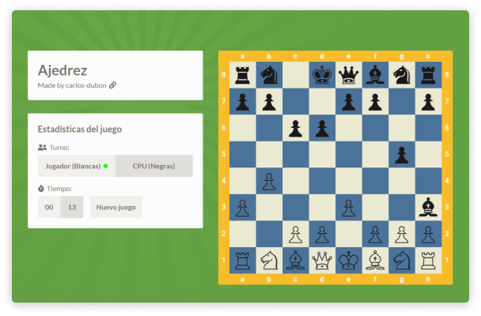

# ♟️ Chess

A chess engine written in pure [TypeScript.](https://www.typescriptlang.org/)

## 💿 Installation

    $ git clone https://github.com/carlos-dubon/chess.git
    $ npm i

## 📦 Production build

    $ npm run build

## 💻 Development server

    $ npm run serve

> You can view the development server at localhost:8081

## 🎮Demo

[Play chess online](https://carlos-dubon.github.io/chess/)

## 🔑 License

[MIT](https://github.com/carlos-dubon/chess/blob/master/LICENSE)
